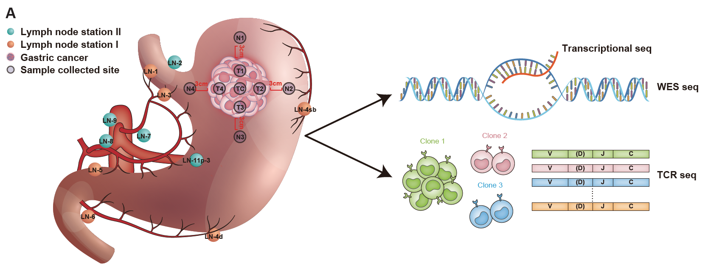

# Introduction
The genetic basis of NATs and evolution (normal adjacent to the tumor) is not unknown. This project amied to extract the genetic information of NATs by sequenceing DNA samples from 13 patients. 

# Sampling

# Results
First, cancer cell infiltration is pervasive in GCs. An average of approximately 50% of NATs harbor mutations from the primary tumor despite of >3cm away from the tumor margin, suggesting the pervasiveness of cancer cell infiltration or field cancerization during GC progression.

Second, the evolution of NATs from the same patient is independent of each other. NAT-private mutations (excluding mutations from the primary tumor) are not shared between NATs from the same patients, indicating that NAT evolves independently. It informs more samples are needed to study the mutation in normal tissues.

Third, the clonal expansion of NATs is not pronounced. The variant allele frequency (VAF) of NAT mutations is generally low (VAF < 0.1), suggesting the absence of clonal expansion. In addition, The high proportion of shared TC among NATs from the same patient indicates that adaptive immune activity is weak, which further supports that clonal expansion is not pronounced. 

Fourth, mutagenesis underlying NAT mutations are distinct from the primary tumor. Aging signature is prevalent in NATs, which is consistent with other studies on pre-cancer or normal tissues(Li et al., 2021). However, we noticed that the smoking signature is predominated in NAT, but vanished in GC, indicating the early impact of smoking on GC initialization. In addition, NATs in one young (27-year-old) female demonstrate a high contribution of signature 18 with nearly no aging-related mutations, but signature 18 vanished in primary tumors. These findings suggest that the extraneous environment plays a great role in the initiation of GC carcinogenesis, which is largely missed by previous studies. 

Fifth, the immune microenvironment of NATs is different from that of primary tumors. NATs show substantial heterogeneity in the immune cell abundance. In contrast to samples from the primary tumor, NATs with a high mutation burden tend to have a lower abundance of immune cells. In addition, the proportion of shared TCR clones among NATs is approximately 4 times higher than that among tumor regions from a primary tumor, suggesting that adaptive immune response is not evidenced in NATs. Thus, these findings also support that the clonal expansion is not pronounced in NATs.

Finally, the evolution of LN metastases of distinct stations is predominantly with linear metastasis. LN metastases are classified by stations. Our results show that different stations might come from different subclones, indicating linear metastasis. In contrast. LN metastasis from the same stations is predominantly with metastasis-to-metastasis patterns.
